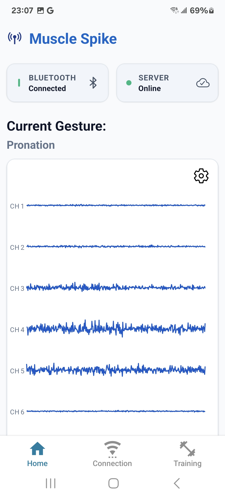
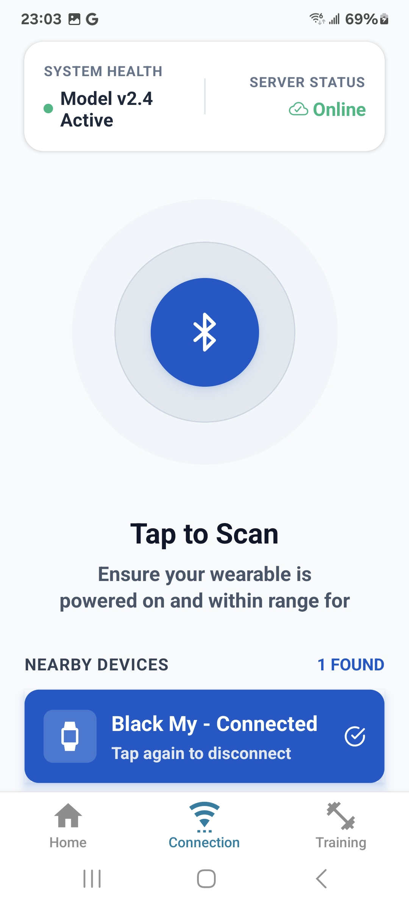
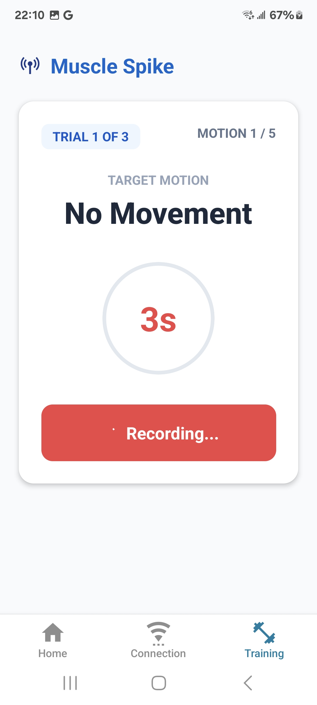
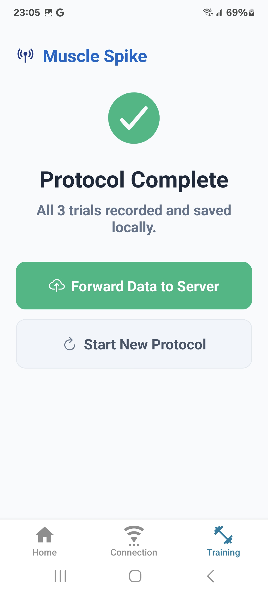
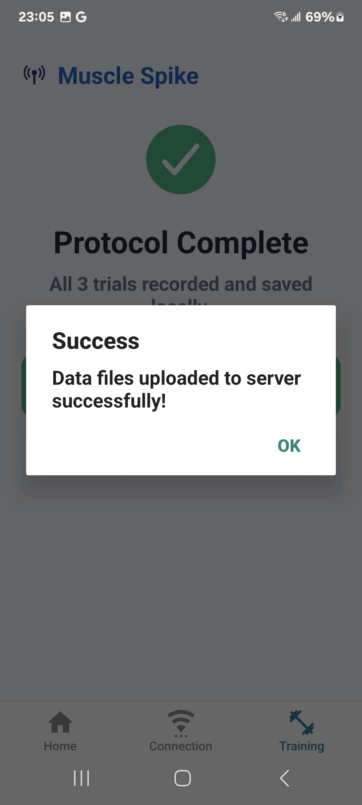

# MuscleSpike Mobile Application

👉 [**MuscleSpike Backend Server**](https://github.com/Anthony-D11/MuscleSpikeServer)

A high-performance React Native mobile application designed to interface with the Myo armband. It streams, processes, and visualizes 8-channel electromyography (EMG) data in real-time with zero UI thread blocking.

## Features

- **Native Bluetooth Low Energy (BLE):** Scans for, connects to, and handles 200Hz data streams from the Myo armband.
- **Real-Time Signal Processing:** Applies full-wave rectification and Exponential Moving Average (EMA) filters to approximate Mean Absolute Value (MAV) on the fly.
- **High-Fidelity Visualizations:** Utilizes React Native Skia and Reanimated worklets to render dynamic charts at 60 FPS without touching the React render cycle.
  - _Radial Chart:_ Spatial mapping of muscle activation.
  - _Amplitude Bars:_ Equalizer-style UI for individual channel intensity.
  - _Raw Signal:_ Real-time oscilloscope view.
- **Dynamic Controls:** Granular channel selection and dynamic chart scaling.
- **Guided Training Flow:** A state-driven wizard that directs users through a fixed calibration and muscle training process.
- **Server Synchronization:** Maintains an active connection to the backend for session data offloading.

## Tech Stack

- **Framework:** React Native / Expo (Custom Development Build)
- **Graphics:** React Native Skia
- **Animation & Worklets:** React Native Reanimated
- **Hardware Integration:** `react-native-ble-plx` (or equivalent BLE library)

## Installation & Setup

Because this app utilizes native Bluetooth modules, it cannot be run inside the standard Expo Go app. You must compile a custom development client.

1. **Clone the repository and install dependencies:**
   ```bash
   git clone https://github.com/Anthony-D11/MuscleSpike.git
   cd MuscleSpike
   npm install
   ```
2. **Configure the local backend:**
   ```bash
   cp .env.example .env
   ```
   Set the value of EXPO_PUBLIC_SERVER_URL to the correct server url. In case the server is on the local machine, find the IPv4 address by using this command in any terminals:
   ```bash
   ipconfig
   ```
3. **Compile and run the development build:**

   ```bash
   # For Android
   npx expo run:android

   # For iOS
   npx expo run:ios
   ```

4. **Demo:**

   Dashboard screen:
   

   Connection screen:
   

   Training screen:
   
   
   
